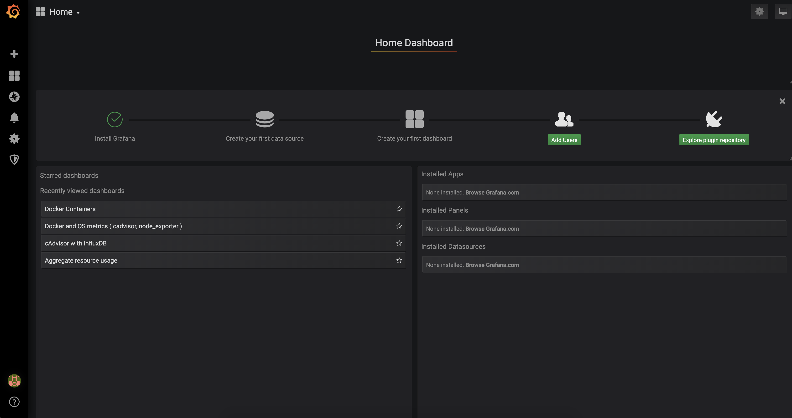
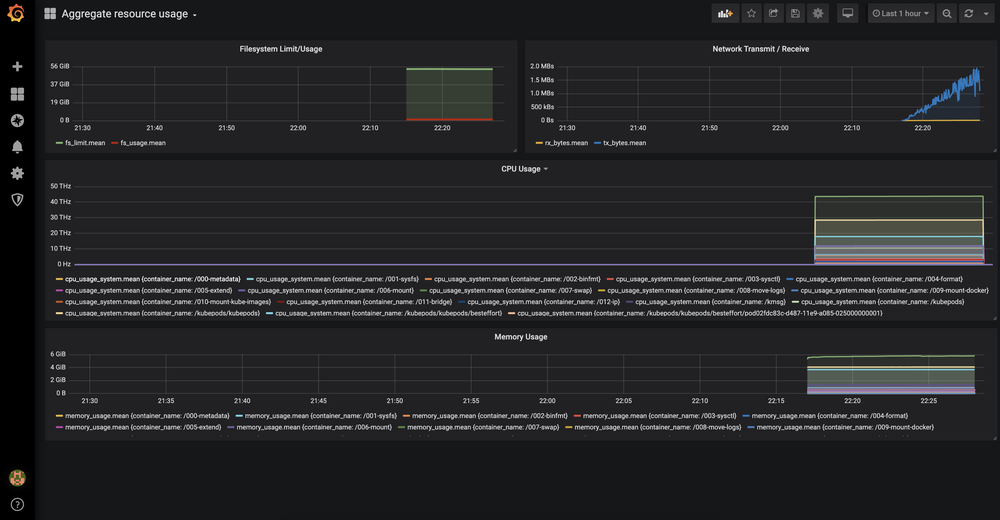
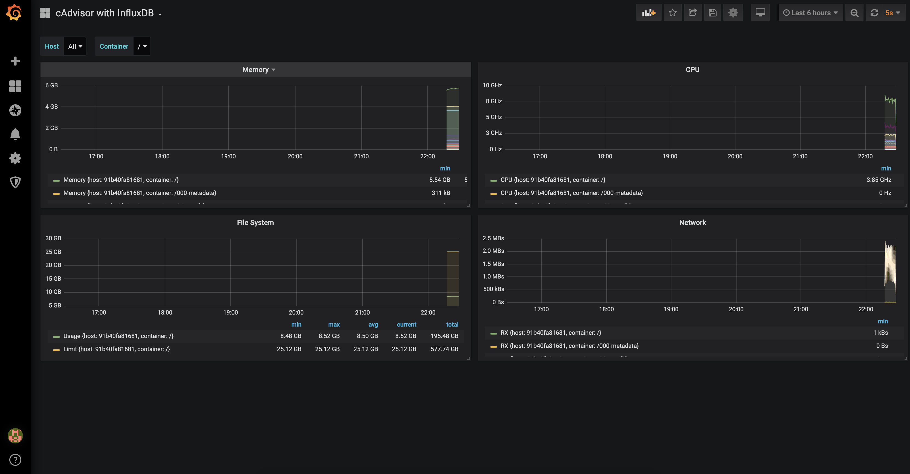
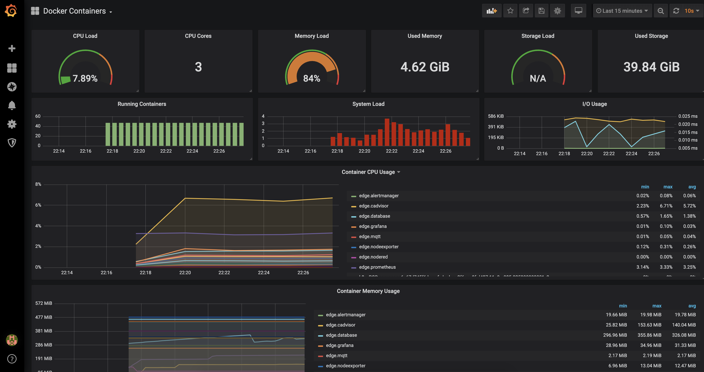
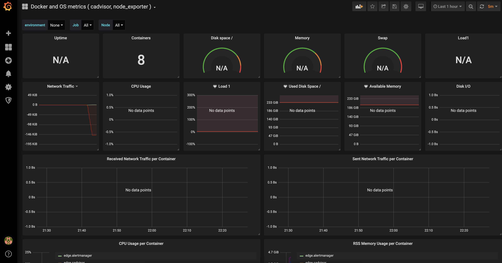

Recopilación de métricas técnicas
=================================

:author: Los Elegidos
:date: 29 de septiembre de 2019
:revision: v1.0

:doctype: book
:docinfo:
:encoding: utf-8
:lang: es
:toc: left
:toclevels: 4
:numbered:
:src_numbered:
:pagenums:
:icons: font
:idprefix:
:idseparator: -
:sectlinks:
:sectanchors:
:experimental:
:source-highlighter: prettify
:coderay-css: style
:status:
:menu:
:navigation:
:split:
:goto:
:blank:
:deckjs_theme: swiss
:showtitle:

// Captions
:toc-title: Índice de contenidos
:figure-caption: Figura

// -------------------------------------------
// Enlaces
// -------------------------------------------

// -------------------------------------------
// Contenido
// -------------------------------------------

[#intro]
== Introducción

Este proyecto es el resultado del reto https://www.onesaitplatformrevolution.com/#/[onesait platform Revolution] para el equipo "Los ElegidOS".

Este reto consta de dos partes, que en los próximos apartados se explicarán:
* Métricas técnicas.
* Métricas funcionales.

[#metricas-tecnicas]
== Métricas técnicas

La plataforma https://onesaitplatform.atlassian.net/wiki/spaces/OP/pages/8913150/Edge+Side[Edge] está desarrollada con el objetivo de instalarse sobre dispositivos. El objetivo del reto es poder aplicar métricas técnicas sobre estos dispositivos y poder visualizar la información de estas métricas.

En este sentido, para la recopilación de métricas técnicas (CPU, memoria...) y visualización de dichas métricas se han utilizado las herramientas:

* <<metricas-tecnicas-cadvisor,cAdvisor>>.
* <<metricas-tecnicas-prometheus,prometheus>>.
* <<metricas-tecnicas-grafana,Grafana>>. 

Todas las herramientas se han configurado para lanzarse utilizando el archivo `docker-compose.yml`.

[#metricas-tecnicas-cadvisor]
=== cAdvisor

La herramienta https://github.com/google/cadvisor[cAdvisor] analiza el uso de recursos y características de rendimiento de los contenedores en ejecución.

La configuración realizada en el `docker-compose.yml` es la siguiente:

[source,yaml]
----
  cadvisor:
    restart: always
    image: google/cadvisor:latest # <1>
    container_name: edge.cadvisor # <2>
    volumes: # <3>
#      - /:/rootfs:ro
      - /var/run:/var/run:rw #<1
      - /sys:/sys:ro
      - /var/lib/docker:/var/lib/docker:ro
    depends_on: # <4>
      - database
    command: -storage_driver=influxdb -storage_driver_db=cadvisor -storage_driver_host=database:8086 # <5>
----

<1> Se indica la imagen Docker a utilizar.
<2> Se indica el nombre del contenedor.
<3> Se indican los volúmenes a compartir entre la máquina host y el contenedor.
<4> Se indica que el contenedor de cAdvisor depende del servicio `database`, el cual contiene la base de datos InfluxDB.
<5> Se indica el comando de ejecución, contactando con la base de datos InfluxDB contenida en el contenedor `database`.

Para que cAdvisor pueda almacenar su información en InfluxDB, es neceseareio crear la base de datos correspondiente `cadvisor`, con el siguiente comando:

[source,shell script]
----
curl -XPOST 'http://localhost:8086/query' --data-urlencode 'q=CREATE DATABASE "cadvisor"'
----

[#metricas-tecnicas-prometheus]
=== prometheus

La herramienta https://prometheus.io/[prometheus] ofrece información sobre métricas dentro de la solución de monitorización.

La configuración realizada en el `docker-compose.yml` es la siguiente:

[source,yaml]
----
  prometheus:
    restart: always
    image: prom/prometheus:latest # <1>
    container_name: edge.prometheus # <2>
    ports: # <3>
      - 9090
    volumes: # <4>
      - ./prometheus/prometheus.yml:/etc/prometheus/prometheus.yml
      - ./prometheus/rules:/etc/prometheus/rules
      - ./prometheus/data:/prometheus
    depends_on: # <5>
      - database
----

<1> Se indica la imagen Docker a utilizar.
<2> Se indica el nombre del contenedor.
<3> Se indica el puerto a exponer.
<4> Se indican los volúmenes a compartir entre la máquina host y el contenedor.
<5> Se indica que el contenedor de prometheus depende del servicio `database`, el cual contiene la base de datos InfluxDB.

El archivo de configuración de prometheus `prometheus.yml` especifica que la base de datos donde almacenar la información sea InfluxDB:

[source]
----
global:
  scrape_interval:     15s # By default, scrape targets every 15 seconds.
  evaluation_interval: 15s # Evaluate rules every 15 seconds.
  external_labels:
    monitor: 'edge-monitor'

rule_files:
  - 'prometheus.rules'
#  - 'rules/host.rules'
#  - 'rules/targets.rules'

scrape_configs:

  - job_name: 'prometheus'
    scrape_interval: 5s
    static_configs:
      - targets: ['localhost:9090']

  - job_name: 'cAdvisor'
    scrape_interval: 5s
    metrics_path: '/metrics'
    static_configs:
      - targets: ['cadvisor:8080']

  - job_name: 'nodeexporter'
    scrape_interval: 5s
    static_configs:
      - targets: ['nodeexporter:9100']

remote_write:
  - url: "http://database:8086/api/v1/prom/write?db=prometheus"
----

Para que prometheus pueda almacenar su información en InfluxDB, es necesario crear la base de datos correspondiente `prometheus`, con el siguiente comando:

[source,shell script]
----
curl -XPOST 'http://localhost:8086/query' --data-urlencode 'q=CREATE DATABASE "prometheus"'
----

[#metricas-tecnicas-grafana]
=== Grafana

La herramienta https://github.com/grafana/grafana[Grafana] permite visualizar información de métricas desde distintas fuentes, ofreciendo dashboards configurables.

La configuración realizada en el `docker-compose.yml` es la siguiente:

[source,yaml]
----
  grafana:
    restart: always
    image: grafana/grafana:latest
    container_name: edge.grafana
    volumes:
      - ./grafana/data:/var/lib/grafana
      - ./grafana/datasources:/etc/grafana/datasources
      - ./grafana/dashboards:/etc/grafana/dashboards
      - ./grafana/setup.sh:/setup.sh
    entrypoint: /setup.sh
    environment:
      - GF_SECURITY_ADMIN_USER=${ADMIN_USER:-admin}
      - GF_SECURITY_ADMIN_PASSWORD=${ADMIN_PASSWORD:-admin}
      - GF_USERS_ALLOW_SIGN_UP=false
    ports:
      - 3000:3000
----

=== Visualización de las métricas

Una vez arrancados todos los contenedores mediante el comando `docker-compose up`, es posible acceder al servicio de Grafana en el puerto 3000, donde se puede ver:

.Home Dashboard

Se puede comprobar que hay cuatro dashboards disponibles:

==== Aggregate resource usage

.Aggregate resource usage

==== cAdvisor with InfluxDB

.cAdvisor with InfluxDB

==== Docker containers

.Docker containers

==== Docker and OS metrics

.Docker and OS metrics

